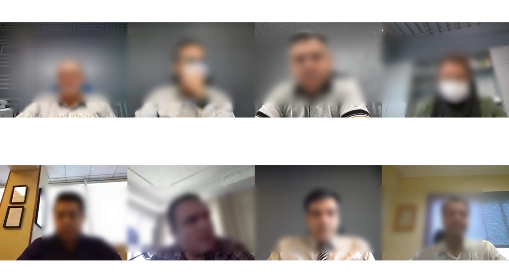

# Session_Reconstruction
Reconstructing the recorded sessions in Janus
- The output of the Janus (WebRTC) video calls are ##.mjr## files, and for everybody in a session, we have three .mjr files, video, audio, and data. Therefore, we should convert the files to visual audio files that are understandable by humans. The [link](https://ourcodeworld.com/articles/read/1198/how-to-join-the-audio-and-video-mjr-from-a-recorded-session-of-janus-gateway-in-ubuntu-18-04) showed how to convert the raw mjr fils to mp4 and wav for video and audio files respectively, and finally merge them to each other by ffmepg. 
- The main challenge of the session reconstruction project is the time that we have multiple persons in a session, and their entrance and exit time to the session is different. Therefore, we should consider their time in the session and create a video-audio file that consists of all the people with their correct attendance time in the session.
- The project was implemented by python and handled different situations for the session.
- ### Attention
Due to the business laws, I can't share all the codes here. If you have any questions you can ask me. Please feel free to contact me.

